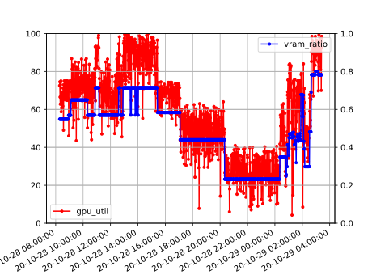

# GPU Load Watcher

Version: 0.4.1 (stable)

Utility to record and plot GPU usage of the deep learning server/workstation.
This repository also contains some helper utilities related to cuda:

1. `cusel`: automatically select a cuda device, allowing us to do `$ CUDA_VISIBLE_DEVICES=$(cusel) python3 train.py`.

## Demo

* Show the statistics in the past day on both system-wide and per-user basis.

```shell
~ ❯❯❯ ansible -i ~/svs.txt all -m shell -a '~/anaconda3/bin/python3 gpuwatch.py stat -s day'
12.123.123.12 | CHANGED | rc=0 >>
:: GPU Usage Statistics (in the past day)
        SYSTEM | gpu_util=   58.33 vram_ratio=    0.49 
         user1 | cumtime=  1133.00 processes=     1.73 vram_occupy=     0.22 
         user2 | cumtime=   801.00 processes=     1.05 vram_occupy=     0.21 
         user3 | cumtime=  1014.00 processes=     1.01 vram_occupy=     0.10 
         user4 | cumtime=   269.00 processes=     1.00 vram_occupy=     0.14 
12.123.12.12 | CHANGED | rc=0 >>
:: GPU Usage Statistics (in the past day)
        SYSTEM | gpu_util=   85.29 vram_ratio=    0.82 
         user1 | cumtime=  1123.00 processes=     7.00 vram_occupy=     0.10 
         user2 | cumtime=  1123.00 processes=     5.60 vram_occupy=     0.41 
         user3 | cumtime=  1123.00 processes=     3.45 vram_occupy=     0.04 
         user4 | cumtime=  1123.00 processes=     2.02 vram_occupy=     0.14 
         user5 | cumtime=  1123.00 processes=     2.07 vram_occupy=     0.12 
         user6 | cumtime=     3.00 processes=     1.00 vram_occupy=     0.07 
```

* Plot the statistics for the past week and collect the result svg graphs. The following is an example graph.



```shell
~ ❯❯❯ ansible -i ~/svs.txt all -m shell -a '~/anaconda3/bin/python3 gpuwatch.py stat -s week --plot'
[...]
~ ❯❯❯ ansible -i ~/svs.txt all -m fetch -a "src=~/gpuwatch.svg dest=."
[...]
~ ❯❯❯ find | rg svg
./123.123.123.123/home/lumin/gpuwatch.svg
./123.123.123.124/home/lumin/gpuwatch.svg
```

* Update the script on the remote servers after modification. (NOTE: you may
need to destroy the sqlite3 database file after modifying the database tables).

```shell
~ ❯❯❯ ansible -i ~/svs.txt all -m copy -a "src=gpuwatch.py dest=~/gpuwatch.py"
```

## Installation and Configuration

**Requirements:**: `pip install gpustat termcolor pylab numpy`. Utility `ansible` is strongly recommended. Besides,
`ansible` is a mandatory requirement if you want to use the `Makefile` shipped in this repository.

**Configuration:** Simply append one the following line to `/etc/crontab` with
modified user name (see `crontab(5)` for details). If your system python3 version
is newer than `python 3.7`, the first line should work. Otherwise please use the
second line and change the executable path according to your python3 installation.

```
* * * * * lumin cd && python3 gpuwatch.py snapshot
* * * * * lumin cd && /home/lumin/anaconda3/bin/python3 gpuwatch.py snapshot
```

## Scale

For large scale GPU clusters for production, I believe there are better (e.g.
fault-tolerant) solutions to monitor the overall status across computation
nodes. The tool provided in this repository is very light-weight, and is more
suitable for the scenario with merely one to several GPU servers.

## See Also

1. SSH-keygen https://www.redhat.com/sysadmin/configure-ssh-keygen
1. Ansible https://docs.ansible.com/ansible/latest/index.html
1. GPUstat https://github.com/wookayin/gpustat

## Copyright

```
Copyright (C) 2020 Mo Zhou <lumin@debian.org>
License: MIT/Expat
```
